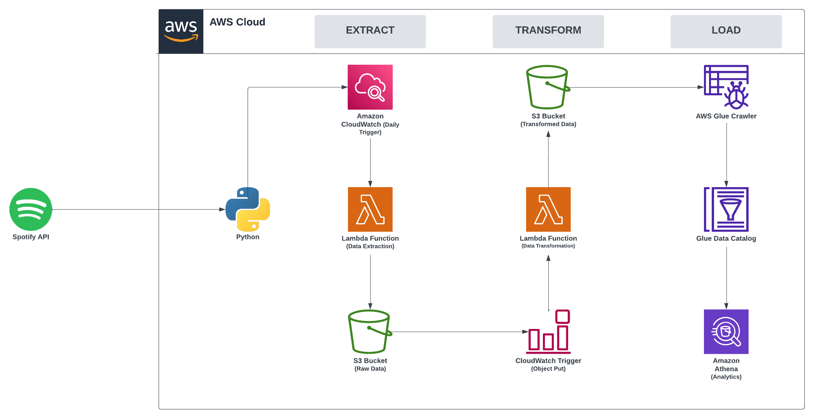

# Spotify's "Top 50 - Global" Playlist: Serverless ETL Project

## Description
This project consists of an ETL Pipeline leveraging Python, Spotify's API, and AWS to gather data from the ["Top 50 - Global" playlist](https://open.spotify.com/playlist/37i9dQZEVXbMDoHDwVN2tF?si=3c950d065c274b3f) that is updated daily with the top 50 songs played on Spotify around the world.

---

## ETL Pipeline Overview

This project is run on and by various AWS services and leverages serverless architecture to help improve developer productivity as there is no need to worry about server management and configuration.

The main components of this project are the two AWS Lambda Functions that each run the Extraction and Transformation steps of the ETL pipeline via the `spotify_api_data_extract.py` and `spotify_api_data_transform.py` files respectively.

The **Extract** function runs daily at a specified time. The way that we are interacting with the Spotify API is through the use of the [**Spotipy**](https://spotipy.readthedocs.io/en/2.22.1/) library and mainly helps with the Authentication to the API. Once the data has been extracted, it is then stored in an S3 Bucket.
> `lambda_layers/spotipy_layer.zip` contains the Spotipy library that must be added as a layer to be used within the AWS Lambda Function

The **Transform** function is triggered whenever raw data is PUT to the S3 Bucket. The function then separates the entirety of the Spotify JSON data into logical datasets for Album, Artist, and Song data. Once the data has been transformed for each dataset, the data is then saved as a CSV and placed into their respective folders.

The **Load** step of the ETL pipeline consists of a few pieces. There are 3 AWS Glue Crawlers that run daily after the album, artist, and song data have been transformed and reads that CSV data and creates a table for each set in AWS Glue Catalog. Finally, this allows the Glue Catalog data to be used for analytics in Amazon Athena. 

---

## License
>You can check out the full license [here](LICENSE)

This project is licensed under the terms of the **MIT** license.